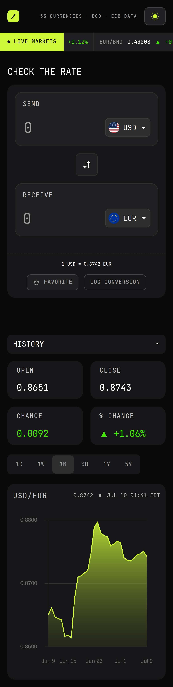
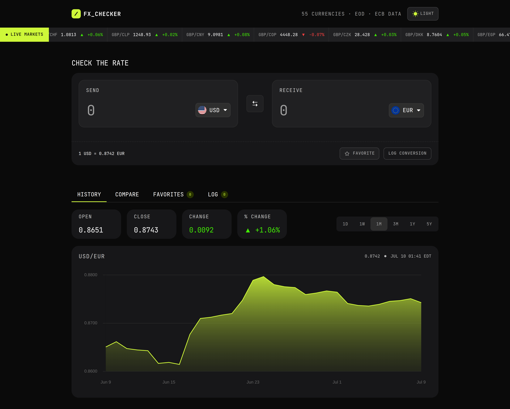

# Frontend Mentor - FX Checker solution

This is a solution to the [FX Checker challenge on Frontend Mentor](https://www.frontendmentor.io/challenges/foreign-exchange-currency-converter). Frontend Mentor challenges help you improve your coding skills by building realistic projects.

## Table of contents

- [Overview](#overview)
  - [The challenge](#the-challenge)
  - [Screenshot](#screenshot)
  - [Links](#links)
- [My process](#my-process)
  - [Built with](#built-with)
  - [What I learned](#what-i-learned)
  - [Continued development](#continued-development)
  - [Useful resources](#useful-resources)
  - [AI Collaboration](#ai-collaboration)
- [Author](#author)

## Overview

### The challenge

Your users should be able to:

#### Converter

- [x] Enter an amount to send and see it convert in real time as they type
- [x] Pick the "send" and "receive" currencies from a searchable currency picker
- [x] See the live exchange rate for the active pair (for example, `1 USD = 0.8530 EUR`)
- [x] Swap the send and receive currencies with the swap button
- [x] Favorite the active pair, and log a conversion to their history

#### Currency picker

- [x] Search the full list of available currencies by code or name
- [x] See currencies grouped into "Popular" and "Other currencies", each row showing the flag, code, and name
- [x] See a check against the currency that's currently selected

#### Live markets ticker

- [x] See a ticker of currency pairs, each with its current rate and 24-hour change (up or down)

#### Rate history

- [x] View a line and area chart of the active pair's rate over time
- [x] Switch the chart range between 1D, 1W, 1M, 3M, 1Y, and 5Y
- [x] See the open, last, absolute change, and percentage change for the selected range

#### Compare

- [x] See their send amount converted into a range of other currencies at once, each with its reference rate
- [x] Pin or unpin any comparison row to their favorites
- [x] Load a pair into the converter by selecting its row

#### Favorites

- [x] See their pinned pairs, each with its live rate and 24-hour change
- [x] Load a pinned pair back into the converter by selecting its row
- [x] Unpin a pair they no longer want to track

#### Conversion log

- [x] See a log of conversions they've made,each showing the relative time, the pair, and the send and receive amounts
- [x] Clear the whole log
- [x] Delete an individual entry

#### UI & accessibility

- [x] View the optimal layout for the interface depending on their device's screen size
- [x] See hover and focus states for all interactive elements on the page
- [x] Navigate the entire app using only their keyboard

#### Extras

- [x] persist currency pairs in the URL so a conversion can be bookmarked or shared

### Screenshot

#### Mobile

#### Desktop

### Links

- Solution URL: [https://github.com/jkaps9/fx-checker](https://github.com/jkaps9/fx-checker)
- Live Site URL: [https://jkaps9.github.io/fx-checker/](https://jkaps9.github.io/fx-checker/)

## My process

- Initially I built this with the API code in various Astro components. However, I noticed that I was reusing a lot of code and could probably use the same API call to fill in various parts of the UI. So I built out a library of controllers by referring back to an old Odin project for structure. This helped reduce the codebase quite a bit and reduce API calls. Further optimization is required, but this will be easier to update.

- For the currency picker I initially went with the modern select - see link in my resources section below which I'll leave because I like it. However, I ultimately needed a custom component so I could include the search feature. This set me back a bit having to refactor, but it was worth it in the end.

- I used ChartJS to build out the line chart because with all of it's built-in functionality it was quite easy to get setup and customize how I needed to fit the design of the project.

### Built with

- Semantic HTML5 markup
- CSS custom properties
- Flexbox
- CSS Grid
- Mobile-first workflow
- [Astro](https://astro.build/)
- [SASS](https://sass-lang.com/)
- [Chart JS](https://www.chartjs.org/)

### What I learned

I further developed my JavaScript/Typescript skills over the course of this project. I also brought back into my memory some patterns I had used in the past but not much since. This helped reinforce my learning of IIFES, separating out functionality to specific controllers, etc.

### Continued development

I know that my code is not as clean as it could be and so I could certainly use some improvement on that front. For example, I struggled with knowing where to separate out logic to various components. Such as in the DOMController I'm sure some items could be separated out to controllers, but it's difficult when they are so interlinked with the DOM.

### Useful resources

- [MDN Fetch API](https://developer.mozilla.org/en-US/docs/Web/API/Fetch_API/Using_Fetch)
  - This helped me understand the fetch API for pulling the FX data
- [MDN Web Storage API](https://developer.mozilla.org/en-US/docs/Web/API/Web_Storage_API/Using_the_Web_Storage_API)
  - This helped me understand how to store favorited currencies and pairs in local storage
- [Nice Select](https://nerdy.dev/nice-select)
  - This resource helped me with designing the select element for the currency selectors

### AI Collaboration

I occasionally used AI to help debug issues with the code, especially with the API calls, when I hit a snag.

## Author

- Frontend Mentor - [@jkaps9](https://www.frontendmentor.io/profile/jkaps9)
